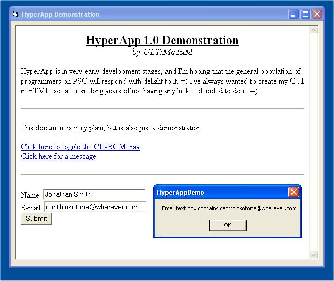



## HyperApp \- Write binary code with HTML\!

### Description

Create GUIs based entirely on HTML or write machine-specific code for web pages!
 
### More Info
 

             |
---                |---
**Submitted On**   |2001-11-01 18:11:44
**By**             |[Jonathan Smith](https://github.com/Planet-Source-Code/PSCIndex/blob/master/ByAuthor/jonathan-smith.md)
**Level**          |Intermediate
**User Rating**    |4.4 (22 globes from 5 users)
**Compatibility**  |VB 6\.0, VB Script
**Category**       |[Internet/ HTML](https://github.com/Planet-Source-Code/PSCIndex/blob/master/ByCategory/internet-html__1-34.md)
**World**          |[Visual Basic](https://github.com/Planet-Source-Code/PSCIndex/blob/master/ByWorld/visual-basic.md)
**Archive File**   |[HyperApp \-326271112001\.zip](https://github.com/Planet-Source-Code/jonathan-smith-hyperapp-write-binary-code-with-html__1-28576/archive/master.zip)

### Source Code

<i><b>HyperApp HTML Interfacing</b></i>

Special thanks to: Stephan (<a href="http://vbpoint.cjb.net">http://vbpoint.cjb.net</a>)
and Chris Kesler

<b>What Is HyperApp?</b>

<blockquote>
 
HyperApp is an script-driven, object-oriented library which
 allows you to add binary code to any web page you create. I designed HyperApp
 originally to allow for clean-looking page forms in my applications with
 little work, but soon after discovered many more uses.

 
HyperApp has three required dependencies:

 <ul>
  <li>
   
Microsoft Script Control (found on Windows 2000 and above,
   or at <a href="http://msdn.microsoft.com/scripting">http://msdn.microsoft.com/scripting</a>)</li>
  <li>
   
Microsoft Internet Controls</li>
  <li>
   
Microsoft HTML Object Library</li>
 </ul>
</blockquote>

<b>HyperApp for the Layman</b>

<blockquote>
 
HyperApp is very easy to use. Simply add a reference to 'HyperApp
 HTML Interfacing Object Library 1.0' and add a web browser component. Write
 any code you want to give the page access to in a class file and pass a new
 instance of the class to the HyperApp object. You can even pass forms or any
 other object.

</blockquote>

<b>Accessing HyperApp through a page</b>

<blockquote>
 
When creating the HTML for your interface, script commands can
 be called by preceding any navigational object with 'happ://' (as opposed to
 'http://'). Immediately following happ://, type the statement you wish to
 call. For example, if you had an object named MyObject, and you wanted to
 access its function OpenFile, you might use the following convention:

 <blockquote>
  
happ://MyObject.OpenFile
  &quot;c:\readme.txt&quot;

 </blockquote>
 
&nbsp;<i>Note:&nbsp; Any references made like this should be
 encoded with hexidecimal to read something like '</i><i>happ://MyObject.OpenFile%20%22c:/readme.txt%22'.
 Using an HTML editor, such as FrontPage, will automatically encode the links
 to this &quot;web-safe&quot; format. HyperApp will automatically decode these
 hex-encoded URLs.</i>

</blockquote>

<b>Reminder: This is Alpha Work</b>

<blockquote>
 
By releasing this code, I'm not saying it's 100% bug-free.
 However, any bugs you come across, please let me know so I can continue to
 update this, what I hope will be, useful tool.

 
Soon to come: a HyperApp plugin for Internet Explorer, which
 will run HyperApp-enabled web pages

 
Please vote if you like this code!

 
&nbsp;

</blockquote>

